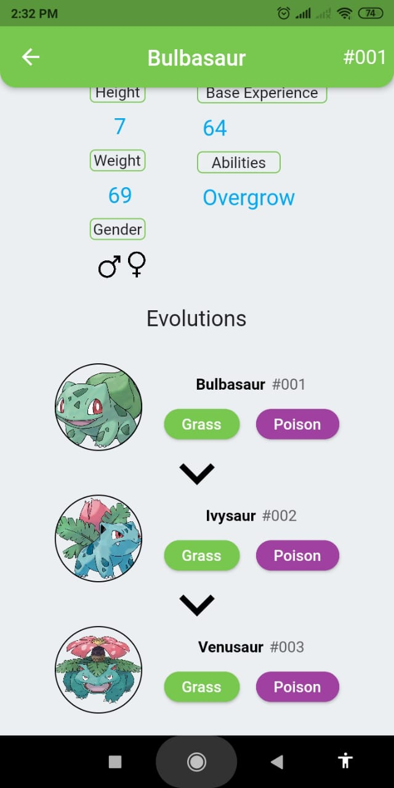

# Pokedex

Project developed using Flutter/Dart. 

Consuming <a href="https://pokeapi.co">pokeAPI</a>, to get the information about the pokemons and getting the images on <a href="https://bulbapedia.bulbagarden.net/wiki/Main_Page">bulbapedia</a>.

## Screens:

## Videos:

